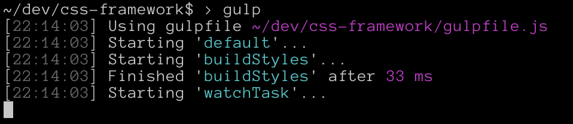

# CSS Framework

Since I needed to dive a little more into CSS to build the new version of my website, I now want to see how CSS frameworks are built and try to build one myself.

I now finished the video tutorial and will adapt and expand the framework just to test things.

## Sources

I'll build this CSS Framework by following yet another tutorial from TheNetNinja that you can find [here (video tutorial)](https://youtube.com/playlist?list=PL4cUxeGkcC9jxJX7vojNVK-o8ubDZEcNb) and [here (github repo)](https://github.com/iamshaunjp/complete-sass-tutorial).

## Compiling & Running

Since web browsers don't understand `SCSS` directly as they do with `CSS`, we have to *compile* our `SCSS` to `CSS`.

To do that, in my and the tutorial case, we use the task runner `gulp`.

### Installation

1. You have to have `node` installed on your computer.
2. Go in the project folder and run `npm install`
3. To run the `gulp` command you have to globally install `gulp-cli`, so run the following command `npm i -g gulp-cli`
4. Run `gulp` and you should see something like the following image in your terminal.

Now, everytime you'll change something in the `index.scss` file, `gulp` will compile it to `css` so that you can directly check the result in your browser.
